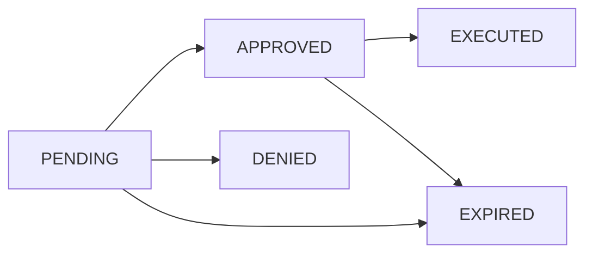

## Endpoint

```
GET /status/:actionId
```

Agent endpoint to poll the current approval state of a request that was blocked by risk assessment (428 response from POST /proxy).

## Authentication

Requires `Agent-Key` header with valid agent API key.

```bash
Agent-Key: your-agent-key-here
```

## Path Parameters

<ParamField path="actionId" type="string" required>
  Unique identifier for the approval queue entry. Returned in the `action_id` field of a 428 Risk-Blocked response.
  
  Example: `act_7f8e9d0c1b2a3456`
</ParamField>

## Response States

The response shape varies based on the current status of the approval queue entry.

### PENDING

Request is awaiting human approval.

<ResponseField name="status" type="string">
  `"PENDING"`
</ResponseField>

<ResponseField name="action_id" type="string">
  The action identifier
</ResponseField>

<ResponseField name="created_at" type="string">
  ISO 8601 timestamp when the request was created
</ResponseField>

### APPROVED

Request has been approved and is ready to execute.

<ResponseField name="status" type="string">
  `"APPROVED"`
</ResponseField>

<ResponseField name="action_id" type="string">
  The action identifier
</ResponseField>

<ResponseField name="execute_url" type="string">
  URL to execute the approved request: `/proxy/execute/:actionId`
</ResponseField>

### DENIED

Request was denied by a human reviewer.

<ResponseField name="status" type="string">
  `"DENIED"`
</ResponseField>

<ResponseField name="action_id" type="string">
  The action identifier
</ResponseField>

<ResponseField name="resolved_at" type="string">
  ISO 8601 timestamp when the request was denied (nullable)
</ResponseField>

### EXPIRED

Approval has expired (TTL exceeded before execution).

<ResponseField name="status" type="string">
  `"EXPIRED"`
</ResponseField>

<ResponseField name="action_id" type="string">
  The action identifier
</ResponseField>

### EXECUTED

Request has been executed and the result is available.

<ResponseField name="status" type="string">
  `"EXECUTED"`
</ResponseField>

<ResponseField name="action_id" type="string">
  The action identifier
</ResponseField>

<ResponseField name="result" type="object">
  The cached response from the executed request
  
  <ResponseField name="status" type="number">
    HTTP status code from the target service
  </ResponseField>
  
  <ResponseField name="headers" type="object">
    Response headers from the target service
  </ResponseField>
  
  <ResponseField name="body" type="string">
    Response body from the target service
  </ResponseField>
</ResponseField>

## Error Responses

<ResponseField name="401 Unauthorized">
  Invalid or missing `Agent-Key` header
</ResponseField>

<ResponseField name="404 Not Found">
  - Action not found
  - Action belongs to a different agent (ownership check)
</ResponseField>

<ResponseField name="500 Internal Server Error">
  Unknown action status or server error
</ResponseField>

## Examples

<CodeGroup>

```bash Poll Status
curl -X GET https://api.gaiterguard.com/status/act_7f8e9d0c1b2a3456 \
  -H "Agent-Key: your-agent-key-here"
```

```json PENDING Response
{
  "status": "PENDING",
  "action_id": "act_7f8e9d0c1b2a3456",
  "created_at": "2026-03-03T14:30:00.000Z"
}
```

```json APPROVED Response
{
  "status": "APPROVED",
  "action_id": "act_7f8e9d0c1b2a3456",
  "execute_url": "/proxy/execute/act_7f8e9d0c1b2a3456"
}
```

```json DENIED Response
{
  "status": "DENIED",
  "action_id": "act_7f8e9d0c1b2a3456",
  "resolved_at": "2026-03-03T14:45:00.000Z"
}
```

```json EXPIRED Response
{
  "status": "EXPIRED",
  "action_id": "act_7f8e9d0c1b2a3456"
}
```

```json EXECUTED Response
{
  "status": "EXECUTED",
  "action_id": "act_7f8e9d0c1b2a3456",
  "result": {
    "status": 201,
    "headers": {
      "Content-Type": "application/json",
      "X-GitHub-Request-Id": "abc123"
    },
    "body": "{\"id\": 123, \"title\": \"Bug report\", \"state\": \"open\"}"
  }
}
```

```json Error Response (404)
{
  "error": "Action not found"
}
```

</CodeGroup>

## Polling Strategy

When a request is blocked (428 response), implement a polling loop:

1. Extract `action_id` from the 428 response
2. Poll `GET /status/:actionId` with exponential backoff
3. Check the `status` field:
   - **PENDING**: Continue polling
   - **APPROVED**: Call `POST /proxy/execute/:actionId` to execute
   - **DENIED**: Handle denial (e.g., log, alert, abort)
   - **EXPIRED**: Resubmit via `POST /proxy` if still needed
   - **EXECUTED**: Use the cached result from the response

## Ownership Security

The endpoint implements strict ownership checks:

- Only the agent that created the request can view its status
- Returns 404 for both "not found" and "wrong agent" cases
- Prevents information disclosure about other agents' requests

## State Transitions



- **PENDING → APPROVED**: Human approves the request
- **PENDING → DENIED**: Human denies the request
- **PENDING → EXPIRED**: Approval TTL expires before decision
- **APPROVED → EXECUTED**: Agent calls POST /proxy/execute/:actionId
- **APPROVED → EXPIRED**: Execution TTL expires before agent executes
