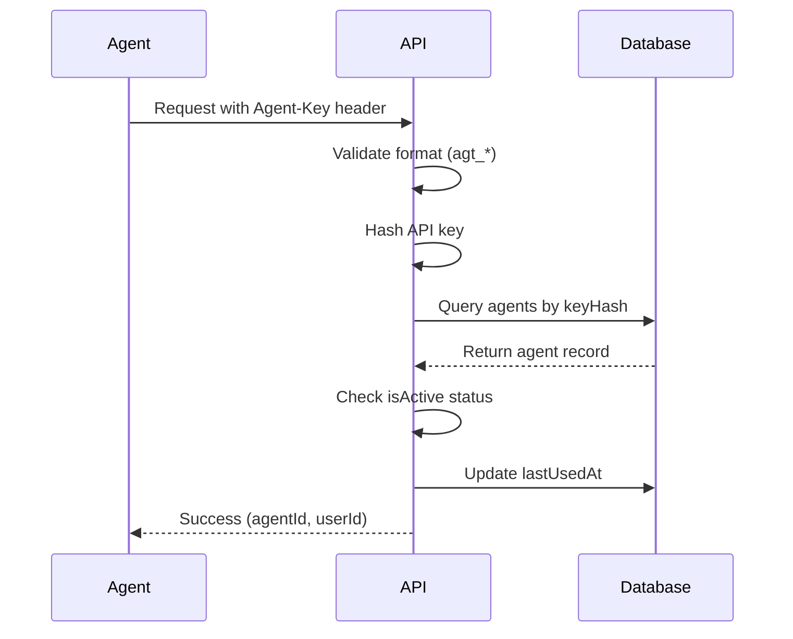

## Overview

Agent-Key authentication is designed for AI agents making API calls to protected services. Each agent has a unique API key that can be scoped to specific services.

## How It Works

Agent keys are validated by the `requireAgentAuth` middleware in `/home/daytona/workspace/source/backend/src/middleware/auth.ts:65`:

1. Extract `Agent-Key` header from request
2. Validate key format (must start with `agt_`)
3. Hash the key and lookup in database
4. Check if agent is active
5. Return agent ID and user ID

## Authentication Flow



## Using Agent-Key in Requests

### Header Format

Include the `Agent-Key` header in every request to protected endpoints:

```bash
curl https://api.example.com/proxy/service-123 \
  -H "Agent-Key: agt_1234567890abcdef1234567890abcdef"
```

<ParamField header="Agent-Key" type="string" required>
  Your agent's API key. Must start with `agt_` prefix.
</ParamField>

## Service-Based Access Control

Agent keys are scoped to specific services via the `agent_services` join table. The `requireServiceAccess` middleware checks authorization:

```typescript
// From middleware/auth.ts:112
export async function requireServiceAccess(
  agentId: number, 
  serviceId: number
): Promise<void>
```

### Access Check Flow

1. Agent authenticates with Agent-Key
2. Request targets a specific service
3. System checks `agent_services` table for relationship
4. Returns `403 Forbidden` if agent lacks access

## Creating Agent Keys

Agent keys are created via the dashboard API (requires JWT authentication):

### Create Agent

<CodeGroup>
```bash cURL
curl -X POST https://api.gaiterguard.com/agents \
  -H "Authorization: Bearer YOUR_ACCESS_TOKEN" \
  -H "Content-Type: application/json" \
  -d '{
    "name": "Production Agent",
    "serviceIds": [1, 2, 3]
  }'
```

```json Response
{
  "agent": {
    "id": 42,
    "name": "Production Agent",
    "userId": 10,
    "keyPreview": "agt_...cdef",
    "isActive": true,
    "createdAt": "2026-03-03T10:00:00Z",
    "lastUsedAt": null
  },
  "apiKey": "agt_1234567890abcdef1234567890abcdef",
  "services": [
    {"id": 1, "name": "OpenAI GPT-4"},
    {"id": 2, "name": "Anthropic Claude"},
    {"id": 3, "name": "Database API"}
  ]
}
```
</CodeGroup>

<Warning>
  The full `apiKey` is **only returned once** during creation. Store it securely - it cannot be retrieved again.
</Warning>

### Request Body

<ParamField body="name" type="string" required>
  Human-readable name for the agent (e.g., "Production Bot", "Staging Agent")
</ParamField>

<ParamField body="serviceIds" type="number[]" required>
  Array of service IDs this agent can access. Pass an empty array `[]` for no service access.
</ParamField>

### Response Fields

<ResponseField name="agent" type="object">
  The created agent record
  
  <ResponseField name="id" type="number">
    Unique agent identifier
  </ResponseField>
  
  <ResponseField name="name" type="string">
    Agent name
  </ResponseField>
  
  <ResponseField name="keyPreview" type="string">
    Truncated key for identification (e.g., `agt_...cdef`)
  </ResponseField>
  
  <ResponseField name="isActive" type="boolean">
    Whether the agent key is active. Defaults to `true`.
  </ResponseField>
  
  <ResponseField name="lastUsedAt" type="string | null">
    ISO timestamp of last API usage. `null` if never used.
  </ResponseField>
</ResponseField>

<ResponseField name="apiKey" type="string">
  **Full API key** - only returned during creation. Store this securely.
</ResponseField>

<ResponseField name="services" type="array">
  List of services this agent can access
</ResponseField>

## Managing Agent Keys

### List All Agents

```bash
curl https://api.gaiterguard.com/agents \
  -H "Authorization: Bearer YOUR_ACCESS_TOKEN"
```

### Update Agent Services

Change which services an agent can access:

```bash
curl -X PUT https://api.gaiterguard.com/agents/42/services \
  -H "Authorization: Bearer YOUR_ACCESS_TOKEN" \
  -H "Content-Type: application/json" \
  -d '{
    "serviceIds": [1, 3, 5]
  }'
```

### Revoke Agent Key

Set `isActive` to `false` to revoke access:

```bash
curl -X PUT https://api.gaiterguard.com/agents/42 \
  -H "Authorization: Bearer YOUR_ACCESS_TOKEN" \
  -H "Content-Type: application/json" \
  -d '{
    "isActive": false
  }'
```

### Delete Agent

Permanently delete an agent and all service associations:

```bash
curl -X DELETE https://api.gaiterguard.com/agents/42 \
  -H "Authorization: Bearer YOUR_ACCESS_TOKEN"
```

## Error Responses

### Missing Agent-Key Header

```json
{
  "error": "Missing Agent-Key header",
  "statusCode": 401
}
```

### Invalid Key Format

```json
{
  "error": "Invalid Agent-Key format",
  "statusCode": 401
}
```

Agent keys must start with `agt_` prefix.

### Invalid or Revoked Key

```json
{
  "error": "Invalid Agent-Key",
  "statusCode": 401
}
```

Returned when:
- Key doesn't exist in database
- Agent's `isActive` is `false`

### Insufficient Service Access

```json
{
  "error": "Agent does not have access to this service",
  "statusCode": 403
}
```

The agent key is valid but not authorized for the requested service.

## Security Best Practices

<AccordionGroup>
  <Accordion title="Store Keys Securely">
    - Use environment variables or secret managers
    - Never commit keys to version control
    - Rotate keys if exposed
  </Accordion>
  
  <Accordion title="Scope Agent Access">
    - Only grant access to required services
    - Create separate agents for different environments
    - Use descriptive names for easy identification
  </Accordion>
  
  <Accordion title="Monitor Usage">
    - Check `lastUsedAt` timestamps regularly
    - Revoke unused agents
    - Review service access periodically
  </Accordion>
</AccordionGroup>

## Implementation Reference

Source code locations:
- Agent authentication middleware: `backend/src/middleware/auth.ts:65`
- Service access check: `backend/src/middleware/auth.ts:112`
- Agent management routes: `backend/src/routes/agents.ts`
- Key hashing utility: `backend/src/utils/apikey.ts`
