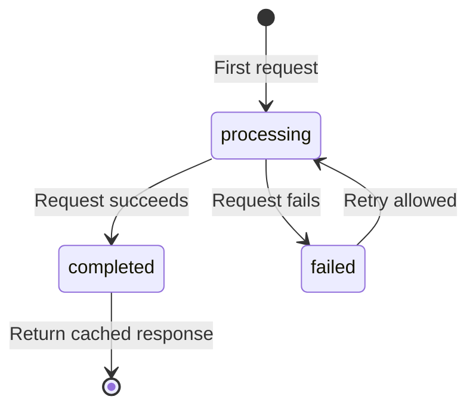

## Overview

Idempotency keys ensure that retrying a request multiple times has the same effect as making it once. This is critical for operations like creating resources or processing payments, where duplicate requests could cause unintended side effects.

**Key benefits**:
- Safely retry failed requests without creating duplicates
- Handle network timeouts and transient errors gracefully
- Guarantee exactly-once semantics for critical operations

## When Idempotency is Required

| Method | Idempotency Key Required? | Reason |
|--------|---------------------------|--------|
| `POST` | **Yes** | Creates new resources; retries could create duplicates |
| `PATCH` | **Yes** | Partial updates; retries could apply changes multiple times |
| `PUT` | No | Fully replaces resource; naturally idempotent |
| `DELETE` | No | Deletes resource; naturally idempotent (404 on retry is acceptable) |
| `GET` | No | Read-only; naturally idempotent |
| `HEAD` | No | Read-only; naturally idempotent |
| `OPTIONS` | No | Read-only; naturally idempotent |

<Warning>
Requests with method POST or PATCH that don't include an idempotency key will be rejected with a 400 validation error.
</Warning>

**Validation logic** (from `services/proxy.service.ts:66`):
```typescript
proxyRequestSchema.refine(
  (data) => {
    // Idempotency key required for POST and PATCH
    if ((data.method === 'POST' || data.method === 'PATCH') && !data.idempotencyKey) {
      return false;
    }
    return true;
  },
  { message: 'idempotencyKey is required for POST and PATCH requests' }
);
```

## How to Use Idempotency Keys

### Header Method (Recommended)

Provide the idempotency key as a request header:

```http
POST /proxy HTTP/1.1
Agent-Key: agt_your_agent_key_here
Idempotency-Key: order-12345-attempt-1
Content-Type: application/json

{
  "targetUrl": "https://api.stripe.com/v1/charges",
  "method": "POST",
  "body": "{\"amount\":1000,\"currency\":\"usd\"}",
  "intent": "Create charge for order 12345"
}
```

### Body Field Method

Alternatively, include it in the request body:

```json
{
  "targetUrl": "https://api.example.com/v1/users",
  "method": "POST",
  "body": "{\"name\":\"Alice\"}",
  "intent": "Create user account",
  "idempotencyKey": "user-registration-alice-001"
}
```

<Note>
**Precedence**: If both the header and body field are present, the header value takes precedence. See `routes/proxy.ts:48`.
</Note>

## Idempotency Key Format

- **Type**: String
- **Length**: 1-255 characters
- **Scope**: Per-agent (different agents can use the same key without collision)
- **Recommendations**: 
  - Use a unique identifier that represents the operation (e.g., `order-{orderId}-{timestamp}`)
  - Include a retry counter for clarity (e.g., `payment-123-retry-2`)
  - Avoid special characters that might require URL encoding

**Example patterns**:
```
order-abc123-creation
user-signup-alice@example.com-2024-03-01
payment-invoice-9876-attempt-1
webhook-delivery-evt_1234567890-retry-3
```

## How Idempotency Works

### Request Hashing

GaiterGuard creates a SHA-256 hash of the request to detect changes:

```typescript
// From services/proxy.service.ts:430
const requestHash = createHash('sha256')
  .update(`${data.method}:${data.targetUrl}:${data.body || ''}`)
  .digest('hex');
```

**Hash includes**:
- HTTP method
- Target URL (including query parameters)
- Request body

<Warning>
If you retry a request with the same idempotency key but different method, URL, or body, the request will be rejected. This prevents accidentally executing a different operation.
</Warning>

### State Machine

Each idempotency key goes through a lifecycle:



| Status | Description | What Happens |
|--------|-------------|-------------|
| `new` | First time seeing this key | Creates record with status=`processing`, executes request |
| `processing` | Request currently in flight | Returns 409 error, tells caller to wait |
| `completed` | Request finished successfully | Returns cached response immediately (cache hit) |
| `failed` | Request failed previously | Deletes old record, creates new one, allows retry |

### Implementation Details

The idempotency logic is implemented in `services/idempotency.service.ts:31`:

```typescript
export async function checkIdempotency(
  agentId: number,
  key: string,
  requestHash: string
): Promise<IdempotencyResult> {
  return await db.transaction(async (tx) => {
    // Look up existing record by (agentId, key)
    const [existing] = await tx
      .select()
      .from(idempotencyKeys)
      .where(and(eq(idempotencyKeys.agentId, agentId), eq(idempotencyKeys.key, key)))
      .limit(1);

    if (!existing) {
      // No existing key, create new record with status='processing'
      const [record] = await tx
        .insert(idempotencyKeys)
        .values({
          agentId,
          key,
          requestHash,
          status: 'processing',
          expiresAt: new Date(Date.now() + 24 * 60 * 60 * 1000), // 24 hours
        })
        .returning();

      return { status: 'new', idempotencyKeyId: record.id };
    }

    // Record exists, check status
    if (existing.status === 'processing') {
      return { status: 'processing' };
    }

    if (existing.status === 'completed') {
      // Return cached response
      return {
        status: 'completed',
        responseStatus: existing.responseStatus!,
        responseHeaders: existing.responseHeaders!,
        responseBody: existing.responseBody!,
      };
    }

    // Status is 'failed', allow retry
    await tx.delete(idempotencyKeys).where(eq(idempotencyKeys.id, existing.id));
    // ... create new record ...
  });
}
```

## Cache Hit Behavior

When a request matches an existing completed idempotency key:

1. Gateway looks up cached response from `idempotency_keys` table
2. Returns the original response status, headers, and body
3. No request is made to the target service
4. Response includes `X-Idempotency-Status: processed` header

**Example**:

```bash
# First request
curl -X POST https://api.gaiterguard.com/proxy \
  -H "Agent-Key: agt_..." \
  -H "Idempotency-Key: charge-001" \
  -d '{"targetUrl": "...", "method": "POST", ...}'

# Response: 201 Created, request forwarded to target
# X-Proxy-Status: forwarded
# X-Idempotency-Status: processed

# Retry with same key
curl -X POST https://api.gaiterguard.com/proxy \
  -H "Agent-Key: agt_..." \
  -H "Idempotency-Key: charge-001" \
  -d '{"targetUrl": "...", "method": "POST", ...}'

# Response: 201 Created, CACHED response returned (no request to target)
# X-Proxy-Status: forwarded
# X-Idempotency-Status: processed
```

## Handling Concurrent Requests

If multiple requests arrive with the same idempotency key while the first is still processing:

**Request 1** (arrives first):
- Creates idempotency record with status=`processing`
- Forwards to target service
- Updates status to `completed` when done

**Request 2** (arrives concurrently):
- Finds existing record with status=`processing`
- Returns `409 Conflict` error immediately
- Client should wait and retry

**Error response**:
```json
{
  "error": "Request with this idempotency key is already being processed",
  "statusCode": 409
}
```

### Recommended Retry Strategy

```python
import time
import requests

def make_idempotent_request(url, data, idempotency_key, max_retries=5):
    headers = {
        "Agent-Key": "agt_...",
        "Idempotency-Key": idempotency_key,
        "Content-Type": "application/json"
    }
    
    for attempt in range(max_retries):
        response = requests.post(url, json=data, headers=headers)
        
        if response.status_code == 409:
            # Request still processing, wait and retry
            wait_time = min(2 ** attempt, 10)  # Exponential backoff, max 10s
            time.sleep(wait_time)
            continue
        
        return response
    
    raise Exception(f"Request still processing after {max_retries} retries")
```

## Transaction Isolation

Idempotency checks use **READ COMMITTED** transaction isolation to prevent race conditions:

```typescript
// From services/idempotency.service.ts:36
return await db.transaction(async (tx) => {
  // All idempotency logic runs in a transaction
  // Ensures atomic check-and-create operations
});
```

This ensures that if two requests arrive simultaneously with the same key:
1. First transaction creates the record with status=`processing`
2. Second transaction sees the existing record and returns 409
3. No duplicate requests are forwarded to the target service

## TTL and Expiration

Idempotency keys have a 24-hour TTL:

```typescript
// From services/idempotency.service.ts:53
expiresAt: new Date(Date.now() + 24 * 60 * 60 * 1000), // 24 hours from now
```

**After expiration**:
- Cached responses are no longer available
- The same idempotency key can be reused for a new operation
- Expired records may be cleaned up by a background job (implementation pending)

<Note>
The TTL starts from when the idempotency key is first created, not when the request completes.
</Note>

## Database Schema

Idempotency keys are stored in the `idempotency_keys` table:

```sql
CREATE TABLE idempotency_keys (
  id SERIAL PRIMARY KEY,
  agent_id INTEGER NOT NULL REFERENCES agents(id) ON DELETE CASCADE,
  key VARCHAR(255) NOT NULL,
  request_hash VARCHAR(64) NOT NULL,  -- SHA-256 hex digest
  status VARCHAR(20) NOT NULL,        -- 'processing' | 'completed' | 'failed'
  response_status INTEGER,
  response_headers TEXT,              -- JSON-serialized
  response_body TEXT,
  created_at TIMESTAMP DEFAULT NOW() NOT NULL,
  completed_at TIMESTAMP,
  expires_at TIMESTAMP NOT NULL,
  UNIQUE (agent_id, key)              -- Unique constraint per agent
);
```

**Key points**:
- Unique constraint on `(agent_id, key)` ensures one record per agent per key
- Indexed on `expires_at` for efficient cleanup queries
- Cascading delete when agent is deleted

## Completing and Failing Idempotency Keys

### On Success

When the proxied request completes successfully:

```typescript
// From services/idempotency.service.ts:102
export async function completeIdempotency(
  id: number,
  responseStatus: number,
  responseHeaders: string,  // JSON-serialized
  responseBody: string
): Promise<void> {
  await db
    .update(idempotencyKeys)
    .set({
      status: 'completed',
      responseStatus,
      responseHeaders,
      responseBody,
      completedAt: new Date(),
    })
    .where(eq(idempotencyKeys.id, id));
}
```

### On Failure

When the proxied request fails:

```typescript
// From services/idempotency.service.ts:127
export async function failIdempotency(
  id: number,
  errorMessage: string
): Promise<void> {
  await db
    .update(idempotencyKeys)
    .set({
      status: 'failed',
      completedAt: new Date(),
    })
    .where(eq(idempotencyKeys.id, id));
}
```

Failed keys allow retry - the next request with the same key will delete the failed record and create a new one.

## Best Practices

### Do's

- Use descriptive, unique keys that represent the operation
- Include identifiers that make the operation traceable (order ID, user ID, etc.)
- Retry 409 errors with exponential backoff
- Keep the same idempotency key when retrying a failed request
- Use the header method for cleaner request bodies

### Don'ts

- Don't reuse idempotency keys for different operations
- Don't change the request body/URL when retrying with the same key
- Don't use random UUIDs (defeats the purpose - retries need the same key)
- Don't use extremely short keys that might collide
- Don't rely on idempotency for GET requests (use them, but they're already safe)

## Example: Creating an Order

```typescript
const axios = require('axios');
const crypto = require('crypto');

async function createOrder(orderId, orderData) {
  // Generate idempotency key based on order ID
  const idempotencyKey = `order-creation-${orderId}`;
  
  const response = await axios.post('https://api.gaiterguard.com/proxy', {
    targetUrl: 'https://api.vendor.com/v1/orders',
    method: 'POST',
    body: JSON.stringify(orderData),
    intent: `Create order ${orderId}`,
  }, {
    headers: {
      'Agent-Key': process.env.GAITERGUARD_AGENT_KEY,
      'Idempotency-Key': idempotencyKey,
      'Content-Type': 'application/json',
    },
  });
  
  return response.data;
}

// Safe to retry on network errors - same idempotency key ensures no duplicates
try {
  await createOrder('ORD-12345', { items: [...], total: 99.99 });
} catch (error) {
  if (error.response?.status === 409) {
    // Wait and retry - original request still processing
    await sleep(2000);
    await createOrder('ORD-12345', { items: [...], total: 99.99 });
  } else {
    throw error;
  }
}
```
