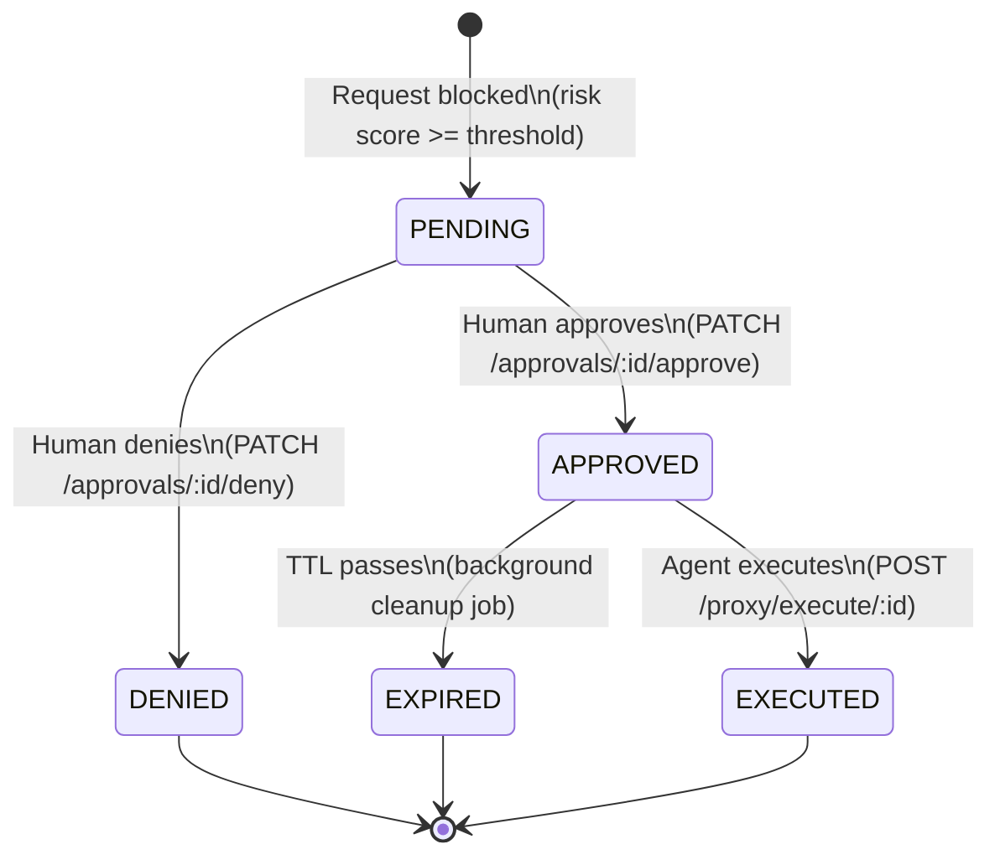
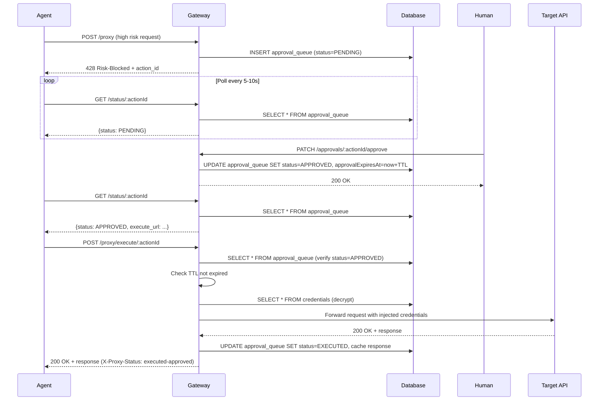

## Overview

When a request exceeds the risk threshold, it enters the **approval queue** and follows a 5-state state machine:

```
PENDING → APPROVED → EXECUTED
        ↓           ↘
     DENIED       EXPIRED
```

Agents poll for status changes and execute approved requests within a TTL window.

<Note>
The default TTL is **1 hour** after approval (configurable via `APPROVAL_EXECUTE_TTL_HOURS`). Approved requests that aren't executed within the TTL expire automatically.
</Note>

## State Machine

The approval state machine is implemented in `backend/src/services/approval.service.ts`.

### States

| State | Description | Terminal? |
|-------|-------------|----------|
| `PENDING` | Awaiting human decision | No |
| `APPROVED` | Human approved, agent can execute | No |
| `DENIED` | Human denied, agent should handle gracefully | Yes |
| `EXPIRED` | Approval TTL passed without execution | Yes |
| `EXECUTED` | Agent executed the request, response cached | Yes |

### Transitions

State transitions are **race-safe** using conditional WHERE clauses:

```typescript
// approval.service.ts:75
export async function transitionStatus(
  actionId: string,
  fromStatus: string,  // Current expected status
  toStatus: string,    // Target status
  extras?: { ... }
): Promise<boolean> {
  const result = await db
    .update(approvalQueue)
    .set({ status: toStatus, ...extras })
    .where(
      and(
        eq(approvalQueue.actionId, actionId),
        eq(approvalQueue.status, fromStatus)  // Only update if current status matches
      )
    )
    .returning({ id: approvalQueue.id });
  
  return result.length > 0;  // Returns false if status already changed
}
```

<Info>
Conditional updates prevent race conditions. If two processes try to update the same action simultaneously, only one succeeds.
</Info>

### Transition Diagram



## Agent Polling Protocol

When an agent receives a 428 response, it should poll `GET /status/:actionId` until the status changes.

### Response Shapes by Status

<Tabs>
  <Tab title="PENDING">
    ```json
    {
      "status": "PENDING",
      "action_id": "550e8400-e29b-41d4-a716-446655440000",
      "created_at": "2026-03-03T10:30:00.000Z"
    }
    ```
    
    **Agent action:** Continue polling every 5-10 seconds
  </Tab>
  
  <Tab title="APPROVED">
    ```json
    {
      "status": "APPROVED",
      "action_id": "550e8400-e29b-41d4-a716-446655440000",
      "execute_url": "/proxy/execute/550e8400-e29b-41d4-a716-446655440000"
    }
    ```
    
    **Agent action:** Call `POST /proxy/execute/:actionId` to execute the request
  </Tab>
  
  <Tab title="DENIED">
    ```json
    {
      "status": "DENIED",
      "action_id": "550e8400-e29b-41d4-a716-446655440000",
      "resolved_at": "2026-03-03T10:35:00.000Z"
    }
    ```
    
    **Agent action:** Handle gracefully (log, notify user, retry with different params)
  </Tab>
  
  <Tab title="EXPIRED">
    ```json
    {
      "status": "EXPIRED",
      "action_id": "550e8400-e29b-41d4-a716-446655440000"
    }
    ```
    
    **Agent action:** Resubmit via `POST /proxy` (starts approval flow over)
  </Tab>
  
  <Tab title="EXECUTED">
    ```json
    {
      "status": "EXECUTED",
      "action_id": "550e8400-e29b-41d4-a716-446655440000",
      "result": {
        "status": 200,
        "headers": { "content-type": "application/json" },
        "body": "{\"success\": true}"
      }
    }
    ```
    
    **Agent action:** Use the cached response (no need to re-execute)
  </Tab>
</Tabs>

### Polling Implementation

Implementation in `backend/src/routes/approval.ts:21`:

```typescript
export async function handleApprovalStatus(
  req: Request,
  params: { actionId: string }
): Promise<Response> {
  const { agentId } = await requireAgentAuth(req);
  
  const row = await getApprovalQueueEntry(params.actionId);
  
  // Return 404 if not found or agent doesn't own it (prevents info leakage)
  if (!row || row.agentId !== agentId) {
    return errorResponse('Action not found', 404);
  }
  
  // Return status-specific response shape
  switch (row.status) {
    case 'PENDING': return Response.json({ status: 'PENDING', ... });
    case 'APPROVED': return Response.json({ status: 'APPROVED', execute_url: ... });
    // ... etc
  }
}
```

### Polling Best Practices

<AccordionGroup>
  <Accordion title="Polling Interval">
    **Recommended:** 5-10 seconds
    
    **Why:**
    - Too fast: wastes server resources, may trigger rate limits
    - Too slow: delays execution, poor user experience
    
    **Example (Python):**
    ```python
    import time
    
    while True:
        response = requests.get(f"{BASE_URL}/status/{action_id}", headers=headers)
        status = response.json()["status"]
        
        if status == "APPROVED":
            break
        elif status in ["DENIED", "EXPIRED"]:
            raise Exception(f"Request {status.lower()}")
        
        time.sleep(7)  # Poll every 7 seconds
    ```
  </Accordion>
  
  <Accordion title="Timeout Handling">
    **Set a maximum polling duration** to avoid infinite loops:
    
    ```python
    import time
    
    MAX_WAIT = 300  # 5 minutes
    start_time = time.time()
    
    while time.time() - start_time < MAX_WAIT:
        # ... poll logic
        time.sleep(7)
    
    raise TimeoutError("Approval timeout after 5 minutes")
    ```
  </Accordion>
  
  <Accordion title="Error Handling">
    **Handle transient errors gracefully:**
    
    ```python
    import requests
    from requests.exceptions import RequestException
    
    retries = 0
    while retries < 3:
        try:
            response = requests.get(f"{BASE_URL}/status/{action_id}", headers=headers)
            response.raise_for_status()
            break
        except RequestException as e:
            retries += 1
            time.sleep(5 * retries)  # Exponential backoff
    ```
  </Accordion>
</AccordionGroup>

## Human Approval

Humans approve or deny requests via the dashboard API.

### Approve Action

```bash
PATCH /approvals/:actionId/approve
Authorization: Bearer <jwt>
```

**Effect:**
- Transitions status: `PENDING → APPROVED`
- Sets `resolvedAt` timestamp
- Sets `approvalExpiresAt` to `now + APPROVAL_EXECUTE_TTL_HOURS`

**Response:**
```json
{
  "success": true,
  "action_id": "550e8400-e29b-41d4-a716-446655440000"
}
```

### Deny Action

```bash
PATCH /approvals/:actionId/deny
Authorization: Bearer <jwt>
```

**Effect:**
- Transitions status: `PENDING → DENIED`
- Sets `resolvedAt` timestamp

**Response:**
```json
{
  "success": true,
  "action_id": "550e8400-e29b-41d4-a716-446655440000"
}
```

### List Pending Approvals

```bash
GET /approvals/pending
Authorization: Bearer <jwt>
```

**Response:**
```json
[
  {
    "id": 123,
    "action_id": "550e8400-e29b-41d4-a716-446655440000",
    "agent_name": "Production Agent 1",
    "service_id": 5,
    "method": "DELETE",
    "target_url": "https://api.github.com/repos/octocat/hello-world",
    "intent": "List all repositories for user octocat",
    "risk_score": 0.9,
    "risk_explanation": "Intent claims to list repos but request is DELETE to specific repo",
    "request_headers": "{\"Content-Type\": \"application/json\"}",
    "request_body": null,
    "created_at": "2026-03-03T10:30:00.000Z"
  }
]
```

<Warning>
The `request_headers` and `request_body` fields have auth headers stripped. Credentials are never stored in the approval queue.
</Warning>

## Execution Flow

After approval, the agent calls `POST /proxy/execute/:actionId` to execute the request.

### Execution Steps

Implemented in `backend/src/routes/proxy.ts:141`:

1. **Authenticate agent** — verify `Agent-Key` header
2. **Fetch approval entry** — look up by `actionId`
3. **Ownership check** — verify agent owns the action (return 404 if not)
4. **Status check** — must be `APPROVED` (409 Conflict otherwise)
5. **TTL check** — if `approvalExpiresAt` passed, transition to `EXPIRED` and return 410 Gone
6. **Credential injection** — decrypt vault secrets and inject into stored headers
7. **Forward request** — send stored request to target API
8. **Cache response** — transition to `EXECUTED` and store response in database
9. **Return response** — send cached response to agent

### Execution Request

```bash
POST /proxy/execute/550e8400-e29b-41d4-a716-446655440000
Agent-Key: gg_...
```

No request body needed — the gateway uses the stored request from the approval queue.

### Execution Response

The response mirrors the target API response:

```
HTTP/1.1 200 OK
Content-Type: application/json
X-Proxy-Status: executed-approved

{"success": true}
```

The `X-Proxy-Status` header distinguishes executed approvals from low-risk passthrough requests.

### TTL Expiration

If the agent doesn't execute within the TTL window:

```
HTTP/1.1 410 Gone
Content-Type: application/json

{
  "error": "Approval has expired — resubmit request via POST /proxy"
}
```

The agent must resubmit the original request, which starts the approval flow over.

## Background Cleanup Job

A background job expires stale approvals every 5 minutes (`server.ts:195`):

```typescript
setInterval(() => {
  expireStaleApprovals().catch((err) => {
    logger.error('Approval TTL cleanup error:', err);
  });
}, 5 * 60 * 1000); // Every 5 minutes
```

### Cleanup Implementation

```typescript
// approval.service.ts:119
export async function expireStaleApprovals(): Promise<void> {
  const result = await db
    .update(approvalQueue)
    .set({ status: 'EXPIRED' })
    .where(
      and(
        eq(approvalQueue.status, 'APPROVED'),
        lt(approvalQueue.approvalExpiresAt, new Date())
      )
    )
    .returning({ actionId: approvalQueue.actionId });
  
  if (result.length > 0) {
    logger.info(`Expired ${result.length} stale approvals`);
  }
}
```

**Race safety:** Only updates rows still in `APPROVED` status. If an agent executes just before cleanup runs, the conditional WHERE prevents the race.

## Database Schema

The `approval_queue` table schema (`backend/src/db/schema.ts:151`):

```typescript
export const approvalQueue = pgTable('approval_queue', {
  id: integer().primaryKey().generatedAlwaysAsIdentity(),
  actionId: varchar({ length: 36 }).notNull().unique(), // UUID v4
  agentId: integer().references(() => agents.id, { onDelete: 'cascade' }),
  serviceId: integer().references(() => services.id, { onDelete: 'cascade' }),
  
  // Stored request (auth headers stripped)
  method: varchar({ length: 10 }).notNull(),
  targetUrl: varchar({ length: 2048 }).notNull(),
  requestHeaders: text(), // JSON-serialized
  requestBody: text(),
  intent: varchar({ length: 500 }).notNull(),
  
  // Risk assessment result
  riskScore: real().notNull(),
  riskExplanation: text().notNull(),
  
  // State machine
  status: varchar({ length: 20 }).notNull().default('PENDING'),
  approvalExpiresAt: timestamp(), // Set when APPROVED
  
  // Timestamps
  createdAt: timestamp().defaultNow().notNull(),
  resolvedAt: timestamp(), // When APPROVED or DENIED
  executedAt: timestamp(), // When EXECUTED
  
  // Cached execution result
  responseStatus: integer(),
  responseHeaders: text(), // JSON-serialized
  responseBody: text(),
});
```

## Sequence Diagram

Complete flow from block to execution:



## Error Scenarios

<AccordionGroup>
  <Accordion title="Agent Executes Expired Approval">
    **Scenario:** Agent polls too slowly and TTL expires
    
    **Response:**
    ```
    HTTP/1.1 410 Gone
    {"error": "Approval has expired — resubmit request via POST /proxy"}
    ```
    
    **Recovery:** Resubmit original request via `POST /proxy`
  </Accordion>
  
  <Accordion title="Human Denies Request">
    **Scenario:** Human reviews request and denies it
    
    **Response:**
    ```json
    {"status": "DENIED", "action_id": "...", "resolved_at": "..."}
    ```
    
    **Recovery:** Agent should handle gracefully (log, notify user, adjust behavior)
  </Accordion>
  
  <Accordion title="Service Deleted During Approval">
    **Scenario:** Service is deleted while request is pending
    
    **Response:**
    ```
    HTTP/1.1 410 Gone
    {"error": "Service no longer exists"}
    ```
    
    **Recovery:** Cannot execute, request must be abandoned
  </Accordion>
  
  <Accordion title="Agent Tries to Execute Another Agent's Action">
    **Scenario:** Agent tries to execute an action belonging to a different agent
    
    **Response:**
    ```
    HTTP/1.1 404 Not Found
    {"error": "Action not found"}
    ```
    
    **Security:** Ownership check prevents info leakage (returns 404, not 403)
  </Accordion>
</AccordionGroup>

## Configuration

### TTL Duration

Configure the execution window in `.env`:

```bash
APPROVAL_EXECUTE_TTL_HOURS=1  # Default: 1 hour
```

The TTL is set when the human approves the request (`backend/src/routes/dashboard.ts`):

```typescript
const approvalExpiresAt = new Date(
  Date.now() + env.APPROVAL_EXECUTE_TTL_HOURS * 60 * 60 * 1000
);

await transitionStatus(actionId, 'PENDING', 'APPROVED', {
  resolvedAt: new Date(),
  approvalExpiresAt,
});
```

### Cleanup Frequency

The cleanup job runs every 5 minutes (hardcoded in `server.ts:195`). To change:

```typescript
setInterval(() => {
  expireStaleApprovals().catch((err) => {
    logger.error('Approval TTL cleanup error:', err);
  });
}, 10 * 60 * 1000); // Change to 10 minutes
```

## Related Concepts

<CardGroup cols={2}>
  <Card title="Risk Assessment" icon="chart-line" href="/concepts/risk-assessment">
    Learn how requests enter the approval queue
  </Card>
  <Card title="Architecture" icon="sitemap" href="/concepts/architecture">
    See where the approval queue fits in the system
  </Card>
  <Card title="Security Model" icon="shield" href="/concepts/security-model">
    Understand why credentials are re-injected at execution
  </Card>
</CardGroup>