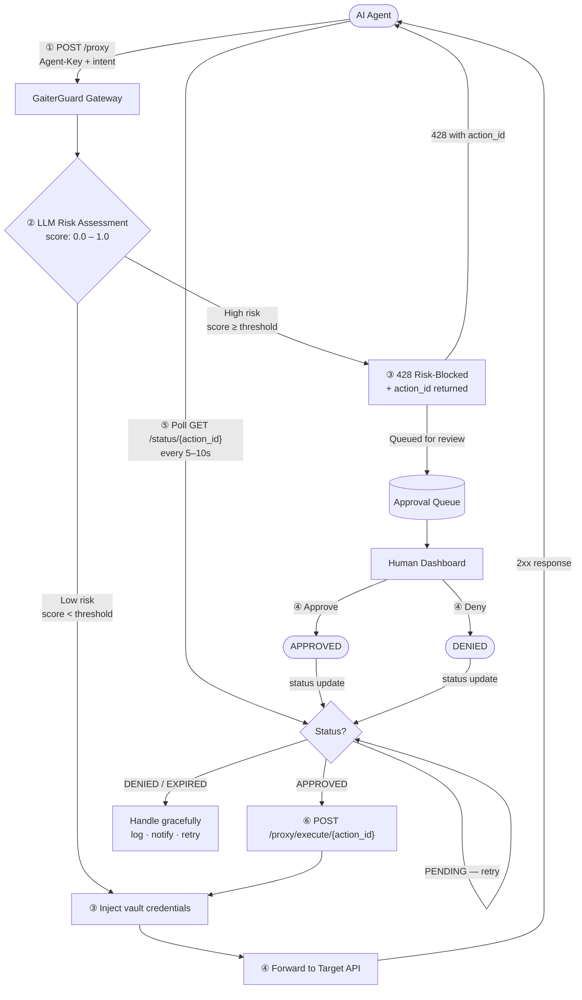
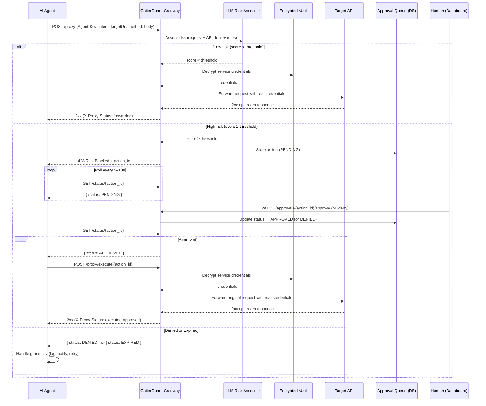

## Overview

GaiterGuard is an intercepting API gateway built on **Bun** that enforces human-in-the-loop (HITL) authorization for autonomous AI agents. The trust boundary is enforced by the gateway — not by the agent.

<Note>
Agents never hold production credentials. All secrets are stored in an encrypted vault and injected at request time by the gateway.
</Note>

## Core Components

GaiterGuard consists of five major subsystems:

### 1. Gateway Core

The main proxy service (`backend/src/services/proxy.service.ts`) orchestrates request handling:

- **Service resolution** — validates agent access to target service
- **SSRF prevention** — validates target URLs against registered service baseUrls
- **Credential injection** — decrypts and injects service credentials
- **Request forwarding** — proxies to target API with 30s timeout and 10MB size limits

```typescript
// proxy.service.ts:380
export async function executeProxyRequest(
  agentId: number,
  userId: number,
  data: ProxyRequestData
): Promise<{ status: number; headers: string; body: string }>
```

### 2. Encrypted Vault

The encryption service (`backend/src/services/encryption.service.ts`) provides AES-256-GCM encryption:

- **Key derivation** — uses scrypt to derive encryption key from `ENCRYPTION_SECRET`
- **Authenticated encryption** — AES-256-GCM with random IV per operation
- **Storage format** — `iv:authTag:ciphertext` (all hex-encoded)

Credentials are stored in the `credentials` table with `encryptedValue` field. See [Security Model](/concepts/security-model) for details.

### 3. Risk Assessor

The risk assessment service (`backend/src/services/risk.service.ts`) evaluates every request:

- **LLM-based intent analysis** — OpenAI-compatible API call with 10s timeout
- **HTTP method heuristics** — baseline risk scores (DELETE: 0.7, PUT: 0.5, POST: 0.3, GET: 0.1)
- **Blended scoring** — `finalScore = llmScore * 0.7 + heuristicScore * 0.3`
- **Fail-closed behavior** — on LLM failure, escalates heuristic score by +0.3

See [Risk Assessment](/concepts/risk-assessment) for the full scoring model.

### 4. Approval Queue

The approval service (`backend/src/services/approval.service.ts`) manages the state machine:

- **5-state model** — PENDING → APPROVED/DENIED → EXECUTED/EXPIRED
- **Race-safe transitions** — uses conditional `WHERE status = fromStatus` updates
- **TTL enforcement** — cleanup job expires approved-but-unexecuted requests

See [Approval Flow](/concepts/approval-flow) for state transitions.

### 5. Agent Authentication

The agent service (`backend/src/services/agent.service.ts`) manages agent identities:

- **Agent-Key generation** — cryptographically random 32-byte keys
- **SHA-256 key hashing** — only hash stored in database
- **Service scoping** — many-to-many relationship via `agent_services` table
- **Revocation** — soft delete via `isActive` flag

## Data Flow

Here's how a request flows through the system:



## Sequence Diagram

This diagram shows the detailed interaction between components:



## Request Lifecycle

Every proxy request follows this 8-step lifecycle (from `proxy.service.ts:380`):

1. **Resolve service** — validates agent has access to target service
2. **Validate target URL** — SSRF prevention checks hostname and path
3. **Risk assessment** — LLM evaluates intent mismatch and method risk
4. **Check idempotency** — returns cached response if duplicate request
5. **Inject credentials** — decrypts vault secrets and adds auth headers
6. **Forward request** — proxies to target API with timeout and size limits
7. **Log audit trail** — writes to `proxy_requests` table (fire-and-forget)
8. **Complete idempotency** — caches response for future duplicate requests

<Warning>
If risk score ≥ threshold at step 3, the request is blocked with HTTP 428 and queued for approval. The agent must poll `/status/:actionId` and execute via `/proxy/execute/:actionId` after approval.
</Warning>

## Tech Stack

| Layer | Technology |
|-------|------------|
| Backend runtime | [Bun](https://bun.sh) |
| Backend framework | `Bun.serve()` (no Express) |
| Database | PostgreSQL 16 |
| ORM | Drizzle ORM |
| Auth | JWT (access + refresh tokens) |
| Encryption | AES-256-GCM via Node.js crypto |
| Risk assessment | OpenAI-compatible LLM |
| Frontend | React 19 + TanStack Router + Vite |

## Directory Structure

```
backend/src/
├── config/       # Environment validation (env.ts, db.ts)
├── db/           # Drizzle schema and client
├── routes/       # Route handlers (auth, services, agents, proxy, approval)
├── services/     # Business logic
│   ├── encryption.service.ts    # AES-256-GCM vault
│   ├── risk.service.ts          # LLM risk assessor
│   ├── approval.service.ts      # State machine
│   ├── proxy.service.ts         # Gateway core
│   ├── agent.service.ts         # Agent CRUD
│   ├── auth.service.ts          # JWT auth
│   └── idempotency.service.ts   # Duplicate request handling
├── middleware/   # Auth and validation
└── utils/        # Response helpers, logging, API key utilities
```

## SSRF Prevention

The gateway implements multiple layers of SSRF protection (`proxy.service.ts:92`):

<Accordion title="SSRF Protection Details">
- **Protocol validation** — only HTTP/HTTPS allowed
- **Hostname matching** — target must match registered service `baseUrl` hostname
- **Path prefix validation** — target path must start with service `baseUrl` path
- **Private IP blocking** — rejects 127.x, 10.x, 192.168.x, 172.16-31.x, 169.254.x, ::1, fc00:, fe80:
- **Localhost blocking** — rejects `localhost` hostname

```typescript
// proxy.service.ts:92
export function validateTargetUrl(targetUrl: string, serviceBaseUrl: string): void {
  // ... validation logic
  if (target.hostname !== base.hostname) {
    throw new ProxyError('Hostname mismatch', 403);
  }
  // ... private IP checks
}
```
</Accordion>

## Trust Boundaries

GaiterGuard enforces two critical trust boundaries:

### 1. Agent ↔ Gateway

- **Agent-Key authentication** — SHA-256 hashed keys in `agents` table
- **Service scoping** — agents can only access explicitly granted services
- **Intent logging** — every request logs stated intent for audit trail

### 2. Gateway ↔ Target API

- **Credential isolation** — agents never see real credentials
- **Request validation** — SSRF checks prevent unauthorized target access
- **Response sanitization** — 10MB size limit prevents memory exhaustion

<Info>
The gateway is the **single point of trust enforcement**. Compromising an agent does not grant access to production credentials or unauthorized services.
</Info>

## Related Concepts

<CardGroup cols={2}>
  <Card title="Security Model" icon="shield" href="/concepts/security-model">
    Learn how secrets are encrypted and scoped to agents
  </Card>
  <Card title="Risk Assessment" icon="chart-line" href="/concepts/risk-assessment">
    Understand the LLM-based risk scoring system
  </Card>
  <Card title="Approval Flow" icon="clock" href="/concepts/approval-flow">
    Explore the state machine and TTL expiration
  </Card>
</CardGroup>