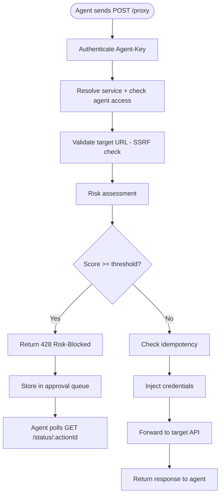

## Overview

GaiterGuard evaluates every proxy request using a **blended risk scoring model** that combines:

1. **LLM intent analysis** — evaluates whether agent's stated intent matches the actual request
2. **HTTP method heuristics** — baseline risk scores for different HTTP methods
3. **Fail-closed behavior** — escalates risk on LLM failure to prevent silent bypass

Requests with `score >= RISK_THRESHOLD` are blocked and queued for human approval.

<Note>
The default threshold is **0.5** (configurable via `RISK_THRESHOLD` environment variable). Scores range from 0.0 (no risk) to 1.0 (critical risk).
</Note>

## Risk Scoring Model

### Blended Score Calculation

The final risk score is a weighted blend of LLM and heuristic components:

```typescript
// risk.service.ts:183
finalScore = llmResult.score * 0.7 + heuristicScore * 0.3
```

**Rationale:** LLM opinion is weighted higher (70%) because it analyzes intent mismatch and request context. Method heuristics provide a safety baseline (30%).

### LLM Intent Analysis

The LLM assessor evaluates whether the agent's stated intent matches the HTTP request:

```typescript
// risk.service.ts:97
async function callLLMForRiskAssessment(
  intent: string,
  method: string,
  targetUrl: string,
  body: string | null
): Promise<{ score: number; explanation: string }>
```

#### System Prompt

The LLM receives this system prompt (`risk.service.ts:33`):

```
You are a security risk assessor for an AI agent gateway.
You evaluate whether an agent's stated intent matches the HTTP request it is making.
You must respond with valid JSON in this exact format:
{"score": <number 0.0-1.0>, "explanation": "<one sentence>"}

Score guidelines:
- 0.0-0.2: Low risk — intent clearly matches a safe read operation
- 0.2-0.5: Medium risk — minor mismatch or write operation with plausible intent
- 0.5-0.8: High risk — significant mismatch or destructive operation
- 0.8-1.0: Critical risk — clear intent mismatch, dangerous method, or suspicious patterns

Respond ONLY with the JSON object. No other text.
```

#### User Prompt

The LLM receives the following context (`risk.service.ts:70`):

```
Agent stated intent: "Charge customer $5 for subscription renewal"

Actual HTTP request:
Method: POST
URL: https://api.stripe.com/v1/charges
Body: {"amount":500,"currency":"usd"}

Assess whether the intent matches the request and provide a risk score.
```

Body is truncated to 500 characters to control token usage.

#### Response Format

The LLM must return JSON:

```json
{
  "score": 0.3,
  "explanation": "Intent matches POST to charges endpoint with correct amount"
}
```

Invalid responses (missing fields, wrong types, malformed JSON) trigger fail-closed behavior.

### HTTP Method Heuristics

Baseline risk scores by HTTP method (`risk.service.ts:52`):

| Method | Score | Rationale |
|--------|-------|----------|
| `DELETE` | 0.7 | Destructive operation, high impact |
| `PUT` | 0.5 | Full resource replacement, medium impact |
| `PATCH` | 0.4 | Partial update, medium-low impact |
| `POST` | 0.3 | Create or action, varies by endpoint |
| `GET` | 0.1 | Read-only, low impact |
| `HEAD` | 0.05 | Metadata only, very low impact |
| `OPTIONS` | 0.05 | Discovery only, very low impact |
| Other | 0.2 | Unknown method, low-medium baseline |

```typescript
function methodBaseScore(method: string): number {
  switch (method.toUpperCase()) {
    case 'DELETE':  return 0.7;
    case 'PUT':     return 0.5;
    case 'PATCH':   return 0.4;
    case 'POST':    return 0.3;
    case 'GET':     return 0.1;
    case 'HEAD':
    case 'OPTIONS': return 0.05;
    default:        return 0.2;
  }
}
```

### Fail-Closed Behavior

If the LLM call fails (timeout, network error, invalid response), the gateway **escalates the heuristic score** by +0.3:

```typescript
// risk.service.ts:189
try {
  const llmResult = await callLLMForRiskAssessment(...);
  finalScore = llmResult.score * 0.7 + heuristicScore * 0.3;
} catch (error) {
  // FAIL CLOSED: escalate heuristic score
  finalScore = Math.min(1, heuristicScore + 0.3);
  explanation = `Risk assessed via method heuristics only (LLM unavailable). Method: ${method}`;
}
```

**Example:** POST request normally has heuristic score 0.3. On LLM failure, score becomes 0.6 (0.3 + 0.3), triggering approval if threshold is 0.5.

<Warning>
LLM unavailability **never** results in a lower risk score. This prevents silent bypass when the LLM service is down.
</Warning>

## Threshold Configuration

The `RISK_THRESHOLD` determines which requests require approval:

```bash
# .env
RISK_THRESHOLD=0.5  # 0.0-1.0
```

Validation enforced at startup (`backend/src/config/env.ts:41`):

```typescript
RISK_THRESHOLD: (() => {
  const val = parseFloat(process.env.RISK_THRESHOLD || '0.5');
  if (isNaN(val) || val < 0 || val > 1) {
    throw new Error('RISK_THRESHOLD must be a number between 0 and 1');
  }
  return val;
})(),
```

### Threshold Tuning

<Tabs>
  <Tab title="Conservative (0.3)">
    **Blocks:** Most write operations (POST, PUT, PATCH, DELETE)
    
    **Passes:** Only GET/HEAD requests with clear intent match
    
    **Use case:** High-security environments, financial transactions, production deployments
  </Tab>
  
  <Tab title="Balanced (0.5)">
    **Blocks:** DELETE, PUT, POST with intent mismatch
    
    **Passes:** GET, low-risk POST/PATCH with intent match
    
    **Use case:** Default setting, suitable for most use cases
  </Tab>
  
  <Tab title="Permissive (0.7)">
    **Blocks:** Only DELETE and high-mismatch requests
    
    **Passes:** Most write operations with plausible intent
    
    **Use case:** Development, testing, trusted agents
  </Tab>
</Tabs>

## Intent Integrity Checking

The LLM compares the agent's stated `intent` field against the actual request payload.

### Example: Intent Match

```json
{
  "intent": "List all GitHub repositories for user octocat",
  "method": "GET",
  "targetUrl": "https://api.github.com/users/octocat/repos",
  "body": null
}
```

**LLM evaluation:**
```json
{
  "score": 0.1,
  "explanation": "Intent matches GET request to list repos endpoint"
}
```

### Example: Intent Mismatch

```json
{
  "intent": "List all GitHub repositories for user octocat",
  "method": "DELETE",
  "targetUrl": "https://api.github.com/repos/octocat/hello-world",
  "body": null
}
```

**LLM evaluation:**
```json
{
  "score": 0.9,
  "explanation": "Intent claims to list repos but request is DELETE to specific repo"
}
```

**Result:** Request blocked with 428 status and queued for approval.

## LLM Configuration

The risk assessor supports any OpenAI-compatible LLM API:

```bash
# .env
LLM_BASE_URL=https://api.openai.com/v1
LLM_API_KEY=sk-...
LLM_MODEL=gpt-4o-mini
LLM_TIMEOUT_MS=10000  # 10 seconds
```

### Supported Providers

<AccordionGroup>
  <Accordion title="OpenAI">
    ```bash
    LLM_BASE_URL=https://api.openai.com/v1
    LLM_MODEL=gpt-4o-mini
    ```
    
    Recommended model: `gpt-4o-mini` (fast, cost-effective)
  </Accordion>
  
  <Accordion title="Azure OpenAI">
    ```bash
    LLM_BASE_URL=https://YOUR-RESOURCE.openai.azure.com/openai/deployments/YOUR-DEPLOYMENT
    LLM_MODEL=gpt-4o-mini
    ```
  </Accordion>
  
  <Accordion title="Anthropic (via proxy)">
    Use a proxy that translates OpenAI format to Anthropic format, such as [LiteLLM](https://github.com/BerriAI/litellm).
  </Accordion>
  
  <Accordion title="Local Models (Ollama/LM Studio)">
    ```bash
    LLM_BASE_URL=http://localhost:11434/v1
    LLM_MODEL=llama3
    ```
    
    Requires OpenAI-compatible API wrapper.
  </Accordion>
</AccordionGroup>

### Request Parameters

The LLM API call uses these parameters (`risk.service.ts:114`):

```typescript
await fetch(`${env.LLM_BASE_URL}/chat/completions`, {
  method: 'POST',
  headers: {
    'Content-Type': 'application/json',
    'Authorization': `Bearer ${env.LLM_API_KEY}`,
  },
  body: JSON.stringify({
    model: env.LLM_MODEL,
    response_format: { type: 'json_object' },  // OpenAI JSON mode
    temperature: 0,                            // Deterministic
    max_tokens: 300,                           // Short responses only
    messages: [
      { role: 'system', content: RISK_SYSTEM_PROMPT },
      { role: 'user', content: buildRiskUserPrompt(...) },
    ],
  }),
});
```

<Info>
**Temperature 0** ensures deterministic, consistent risk scores. The LLM should not introduce randomness into security decisions.
</Info>

## Risk Assessment Flow

Risk assessment runs **after URL validation** but **before idempotency check** (`proxy.service.ts:399`):



**Rationale:** Risky requests are blocked before any expensive operations (credential decryption, API calls). This prevents resource exhaustion attacks.

## Blocked Request Handling

When a request is blocked, the agent receives a **428 Precondition Required** response:

```json
{
  "error": "Request requires human approval",
  "action_id": "550e8400-e29b-41d4-a716-446655440000",
  "risk_score": 0.85,
  "risk_explanation": "Intent claims to list repos but request is DELETE to specific repo",
  "status_url": "/status/550e8400-e29b-41d4-a716-446655440000"
}
```

The agent should:

1. Extract the `action_id`
2. Poll `GET /status/:action_id` every 5-10 seconds
3. Wait for status to change from `PENDING` to `APPROVED` or `DENIED`
4. If `APPROVED`, call `POST /proxy/execute/:action_id` to execute

See [Approval Flow](/concepts/approval-flow) for the full state machine.

## Dashboard Review Context

Humans reviewing blocked requests in the dashboard see:

- **Agent name** — which agent made the request
- **Service name** — target API being accessed
- **Intent** — agent's stated purpose
- **HTTP method** — GET, POST, DELETE, etc.
- **Target URL** — full URL with path and query params
- **Request headers** — all headers except `Authorization` and `Agent-Key` (stripped)
- **Request body** — full payload (truncated to 500 chars in LLM prompt, but stored in full)
- **Risk score** — 0.0-1.0 final score
- **Risk explanation** — LLM's one-sentence justification
- **Timestamp** — when request was blocked

This provides full context for informed approval decisions.

## Tuning Risk Assessment

### Scenario: Too Many False Positives

**Symptom:** Legitimate requests are frequently blocked

**Solutions:**
1. Increase `RISK_THRESHOLD` from 0.5 to 0.6 or 0.7
2. Improve agent's `intent` descriptions (be more specific)
3. Review LLM model choice (some models are more conservative)

### Scenario: Too Few Blocks

**Symptom:** Risky requests pass through without approval

**Solutions:**
1. Decrease `RISK_THRESHOLD` from 0.5 to 0.4 or 0.3
2. Review method heuristics (consider custom weights per service)
3. Add custom rules to LLM system prompt (see below)

### Custom Risk Rules

You can extend the system prompt with service-specific rules. Modify `RISK_SYSTEM_PROMPT` in `risk.service.ts:33`:

```typescript
const RISK_SYSTEM_PROMPT = `You are a security risk assessor for an AI agent gateway.
...

Additional rules:
- Any Stripe charge > $100 USD requires approval (score >= 0.8)
- GitHub repository deletions always require approval (score = 1.0)
- Shopify order cancellations require approval if reason is not "customer_request" (score >= 0.7)

Respond ONLY with the JSON object. No other text.`;
```

<Warning>
Modifying the system prompt may affect LLM behavior unpredictably. Test thoroughly in a non-production environment first.
</Warning>

## Logging and Monitoring

All risk assessments are logged at `INFO` level:

```
INFO Risk assessment result: score=0.85, blocked=true, target=https://api.github.com/repos/octocat/hello-world
```

LLM failures are logged at `WARN` level:

```
WARN Risk assessment LLM failure (falling back to heuristics): LLM API returned 503: Service Unavailable
```

Debug logging includes LLM response details:

```
DEBUG LLM risk assessment success: score=0.85, explanation="Intent claims to list repos but request is DELETE to specific repo"
```

Monitor these logs to tune threshold and identify LLM issues.

## Related Concepts

<CardGroup cols={2}>
  <Card title="Approval Flow" icon="clock" href="/concepts/approval-flow">
    Learn what happens after a request is blocked
  </Card>
  <Card title="Security Model" icon="shield" href="/concepts/security-model">
    Understand intent integrity in the trust model
  </Card>
  <Card title="Architecture" icon="sitemap" href="/concepts/architecture">
    See where risk assessment fits in the request lifecycle
  </Card>
</CardGroup>